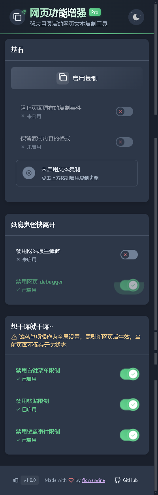

<div align="center">
  
  <h1>✨ Nice Extension ✨</h1>
  <div>一个优雅的浏览器扩展</div>
  <div>能解除大多数网页的限制🚀</div>
</div>

## 🌟 功能特色

- 🎯 **一键启用复制**: 一键启用复制，无限制地复制网页上任何内容，并可复制带有原文的 HTML 格式的文本。
- 🛠️ **调试增强**: 自动移除网页的 debugger 断点，让逆向再无障碍。屏蔽烦人的原生弹窗（alert/confirm/prompt）。
  🚀 **全方位解除限制**: 解除鼠标右键限制、粘贴限制、键盘事件限制，你的操作再无障碍。
- ✨ **精美的UI**: 精心设计的亮色/暗色主题，精美的的动画效果和现代化的界面设计。

## 💡 使用指南

1. 点击前往 [Release 页面](https://github.com/flower0wine/nice/releases) 下载最新版本 zip 文件，如果你不会安装该类型文件，点击前往 [哔哩哔哩——zip 插件安装](https://www.bilibili.com/opus/990637127408549913)。
1. 点击浏览器工具栏中的 Nice 图标
1. 在弹出窗口中开启所需功能：

- 🔓 **启用文本复制**: 移除复制限制，保留原文格式，启用后自动开启 `禁用网站自带的复制事件监听` 和 `保留复制文本的 HTML 格式` 两个选项。
- 🎯 **禁用网站的复制监听事件**: 有些网站在复制时会弹窗，十分影响体验，还有些网站会在复制的文本中添加一些无关的信息，开启这个选项能避免这些问题。
- 🎨 **保留复制文本的 HTML 格式**: 当你复制一些带有样式的文本时，开启这个选项能保留文本的样式。但是并不保证一定生效，比如复制的文字颜色并不能保留。
- 🔧 **禁用网页 debugger**: 默认开启，移除网页中的 debugger 断点。由于某些网页的代码使用了`混淆`，无法通过字符串匹配的方式去除 debugger，所以在一些网页上可能会失效，你可以在 [Issues 页面](https://github.com/flower0wine/nice/issues/new) 给出遇到问题的网址。
- 🚫 **禁用网站原生弹窗**: 可选地移除网站的 alert、confirm、prompt 等原生弹窗，避免烦人的提示框。
- 🖱️ **禁用右键菜单限制**: 解除网站对右键菜单的限制，开启后刷新网页开始生效。
- 📋 **禁用粘贴限制**: 解除网站对粘贴操作的限制，开启后刷新页面开始生效。
- ⌨️ **禁用键盘事件限制**: 解除网站对键盘快捷键的限制，开启后刷新页面开始生效。
  > 💡 注意：部分功能需要刷新页面后生效，如遇到问题请在 [Issues 页面](https://github.com/flower0wine/nice/issues/new) 反馈。

## 插件截图

<div align="center">
  
  
</div>

## 🔧 兼容性

| 浏览器  | 最低版本 | 推荐版本 |
| ------- | -------- | -------- |
| Chrome  | 88+      | 最新版   |
| Edge    | 88+      | 最新版   |
| Firefox | 78+      | 最新版   |
| Opera   | 74+      | 最新版   |

> 💡 提示：为获得最佳体验，建议使用各浏览器的最新版本。

## 🚀 开发指南

本项目使用 [Plasmo](https://docs.plasmo.com/) 框架开发，采用 pnpm 作为包管理器。

### 开发环境设置

```bash
# 安装依赖
pnpm install

# 启动开发服务器
pnpm dev

# 构建生产版本
pnpm build
```

## 可能的疑问

### Q: 为什么不发布到插件商店？

A: 本来我也是想发的，但是 `Edge` 和 `Chrome` 注册开发者都要收费，Edge 注册费为 **114 元**，Chrome 注册费为 **5 美元**，本身这个插件就是**免费**的，所以就没注册，所以只能手动下载安装。

如果你想让这个插件发布在插件商店中，你可以赞助我部分资金，这会加快它出现在商店中的进度。

<div align="center">
  
  
</div>

## 🤝 贡献指南

如果你是小白并且遇到了问题，可以前往 [Issues 页面](https://github.com/flower0wine/nice/issues/new) 创建问题，这个是与开发者交流的渠道。

如果你是开发者，并且有更好的 Pull Request，请前往 [Pull Request 页面](https://github.com/flower0wine/nice/pulls) 提交你的代码。

## 📝 开源协议

项目采用 [MIT License](LICENSE) 开源协议。你可以免费使用、修改、分发和商业使用。
